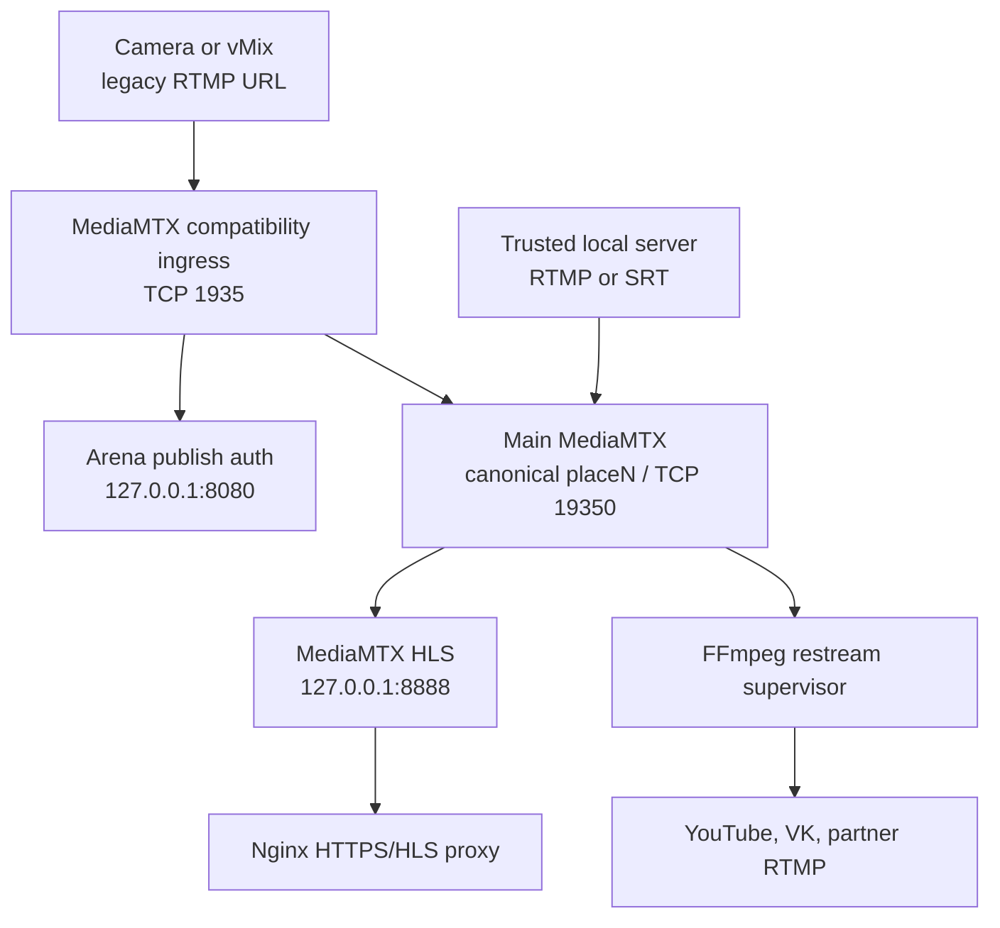

# Arena RTMP Node

Production video-ingress, HLS monitoring and RTMP restream node for Arena76.

The current architecture uses MediaMTX for all 16 canonical media paths while
preserving the original camera publishing URLs. Nginx remains the HTTPS server
and HLS reverse proxy, but no longer owns the public RTMP listener.

## What the project provides

- 16 isolated canonical paths: `place1` through `place16`;
- unchanged public camera URLs:
  `rtmp://HOST/placeN/streamN?key=PLACE_KEY`;
- per-place publish authentication through a loopback callback;
- RTMP and SRT input without mandatory transcoding;
- fMP4 HLS with the legacy public URL
  `/hls/placeN/streamN.m3u8`;
- several outgoing RTMP destinations per place through FFmpeg `-c copy`;
- independent web manager and privileged restream supervisor;
- live technical metrics without exposing keys, destinations or client IPs;
- viewer, operator, manager and administrator roles;
- protected configuration migrations, backups and updater rollback;
- hardened systemd services running as dedicated unprivileged users.

## Production media flow



The compatibility layer validates the existing `placeN/streamN?key=...`
address and forwards the accepted stream to canonical `placeN`. Therefore
cameras do not need new URLs or new publish keys when migrating from
Nginx-RTMP.

## Main services

| Unit | Responsibility |
|---|---|
| `arena-mediamtx-ingress.service` | Public legacy-compatible RTMP ingress |
| `mediamtx.service` | Canonical RTMP/SRT paths, HLS and metrics |
| `arena-rtmp-auth.service` | Publish authentication for old and new ingress |
| `arena-restream-supervisor.service` | Owns outgoing FFmpeg processes |
| `arena-restream-manager.service` | Web UI, API, configuration and monitoring |
| `nginx.service` | TLS, static UI and HLS reverse proxy |

## Repository layout

- `app/` — manager, monitoring, authentication and supervisor code;
- `web/` — browser monitoring and administration UI;
- `mediamtx/` — secret-free main gateway reference;
- `nginx/` — templates used by the safe renderer;
- `systemd/` — hardened unit files;
- `config/` — public examples only;
- `scripts/` — install, update, migration, render and audit utilities;
- `docs/` — deployment, security and operational procedures;
- `legacy/` — disabled historical DVR implementation for reference.

## Safety boundary

These live files are intentionally outside Git:

- `/etc/mediamtx/mediamtx.yml`;
- `/etc/mediamtx/ingress.yml`;
- `/opt/arena-rtmp-node/config/node.env`;
- `/opt/arena-rtmp-node/config/nginx-render.json`;
- `/opt/arena-rtmp-node/state/restream-config.json`;
- user database, audit records, logs, PID files and previews.

Examples contain placeholders only. Never paste production publish keys,
destination URLs, session secrets or MediaMTX forwarding credentials into an
issue, PR, commit or diagnostic output.

## Source validation

```bash
python3 -m py_compile app/*.py scripts/*.py
node --check web/script.js
python3 -m json.tool config/restream-config.example.json >/dev/null
python3 -m json.tool config/nginx-render.example.json >/dev/null
python3 -m unittest discover -s tests -v
python3 scripts/audit_systemd.py --max-exposure 3.0
```

## Installation and update

The initial installer copies project files only. It never activates Nginx,
systemd, DNS or TLS:

```bash
sudo ./scripts/install.sh check
sudo ./scripts/install.sh install
```

For an existing managed node:

```bash
sudo ./scripts/update.sh check
sudo ./scripts/update.sh apply --confirm UPDATE
```

The updater preserves private configuration, creates a protected backup and
rolls application code back after a failed health check. It deliberately never
restarts either MediaMTX process.

Nginx files are rendered into staging before installation:

```bash
cp config/nginx-render.example.json config/nginx-render.json
chmod 600 config/nginx-render.json

python3 scripts/render_nginx.py \
  --profile config/nginx-render.json \
  --output-dir build/nginx
```

With `"rtmp_enabled": false`, the generated RTMP fragment contains no
Nginx-RTMP applications; MediaMTX owns TCP 1935.

## Documentation

- [Full MediaMTX deployment](docs/MEDIAMTX_DEPLOYMENT.md)
- [Operations and diagnostics](docs/OPERATIONS.md)
- [General deployment](docs/DEPLOYMENT.md)
- [Security model](docs/SECURITY.md)
- [Role model](docs/RBAC.md)
- [Historical first migration](docs/FIRST_MIGRATION.md)
